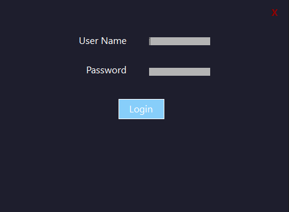
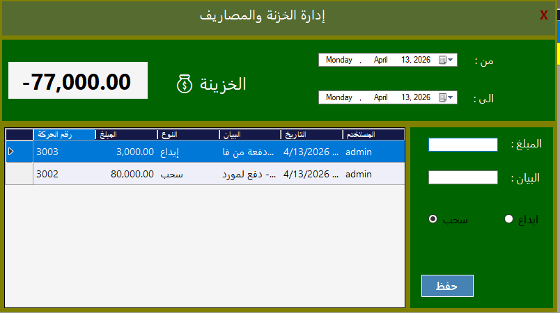
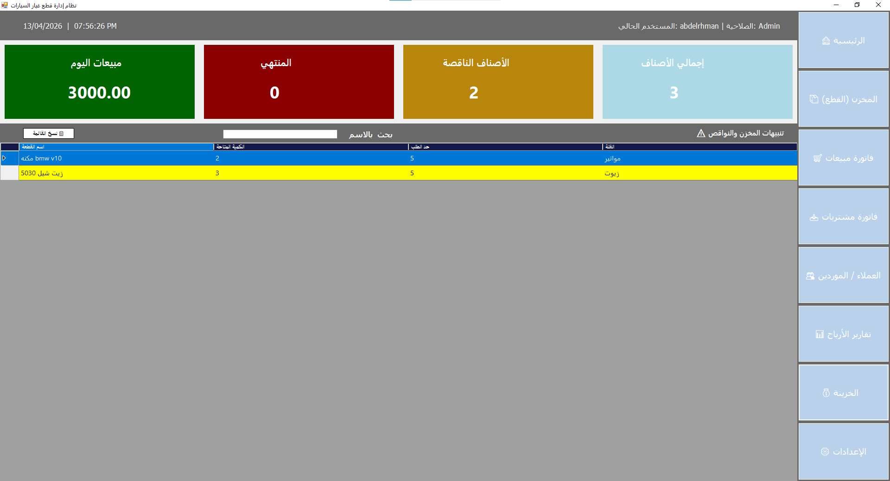
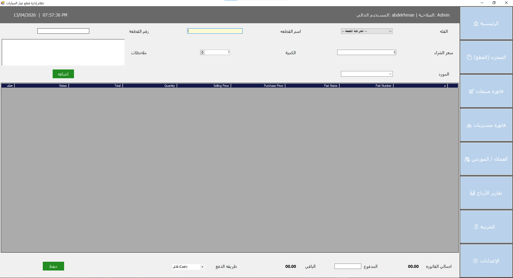

# 🛠️ نظام إدارة محل قطع غيار سيارات (Auto Parts Store Management System)

نظام متكامل لإدارة المبيعات، المشتريات، والمخازن، مصمم خصيصاً لادارة المحلات. تم بناء النظام باستخدام تقنيات حديثة لضمان الأداء العالي والأمان.

---

## 🚀 المميزات الرئيسية (Features)

* **إدارة الخزينة (Safe Management):** مراقبة دقيقة لكل الوارد والصادر مع تحديث لحظي للرصيد.
* **نظام المبيعات والمشتريات:** تسجيل الفواتير وربطها تلقائياً بالخزينة والمخزن.
* **نظام الصلاحيات (Security):** حماية الشاشات الحساسة باستخدام **Admin PIN Code** لضمان الخصوصية.
* **فلترة متقدمة:** إمكانية عرض التقارير وحركات الخزنة خلال فترات زمنية محددة بدقة عالية.
* **واجهة مستخدم احترافية:** تصميم مريح للعين يدعم سرعة الإدخال باستخدام زر الـ **Enter**.
* **بنية كود نظيفة (Clean Code):** اتباع مبادئ **Repository Pattern** و **Dependency Injection** لسهولة التطوير.

---

## 📸 صور من داخل النظام (Screenshots)

| شاشة الدخول | شاشة الخزينة |
| :---: | :---: |
|  |  |

|  |  |

|  |  |

|  |


---

## 🛠️ التقنيات المستخدمة (Tech Stack)
x   
* **اللغة:** C#
* **المنصة:** .NET Framework (WinForms)
* **قاعدة البيانات:** SQL Server
* **النمط البرمجي:** Repository Pattern

---

## ⚙️ كيفية التشغيل (Setup)

1.  قم بعمل **Clone** للمستودع:
    ```bash
    git clone [https://github.com/yourusername/auto-parts-store.git](https://github.com/yourusername/auto-parts-store.git)
    ```
2.  قم بتشغيل ملف الـ `Database.sql` المرفق على **SQL Server Management Studio**.
3.  قم بتغيير **ConnectionString** في ملف الـ `App.config` ليتناسب مع جهازك.
4.  افتح المشروع باستخدام **Visual Studio 2022** واعمل **Build**.

---

## 👨‍💻 المساهمة (Contribution)

هذا المشروع مخصص للأغراض التعليمية وتطوير الأعمال الصغيرة. إذا كان لديك أي اقتراح لتحسين الكود أو إضافة مميزات جديدة، يسعدني استقبال **Pull Requests**.

---

## 📄 الترخيص (License)

هذا المشروع متاح تحت رخصة **MIT**. يمكنك استخدامه وتطويره كما تحب.

---
**تم التطوير بواسطة: [Abdelrahman Mohamed Hamed]**